# Chapter 2: Architecture Deep Dive

> **Chapter Overview**: This chapter explores the internal architecture of OJP, detailing its components, communication protocols, and connection pool management. You'll understand how the pieces fit together to deliver intelligent database connection management.

---

## 2.1 System Components

OJP's architecture consists of three main components that work together to provide transparent connection management:

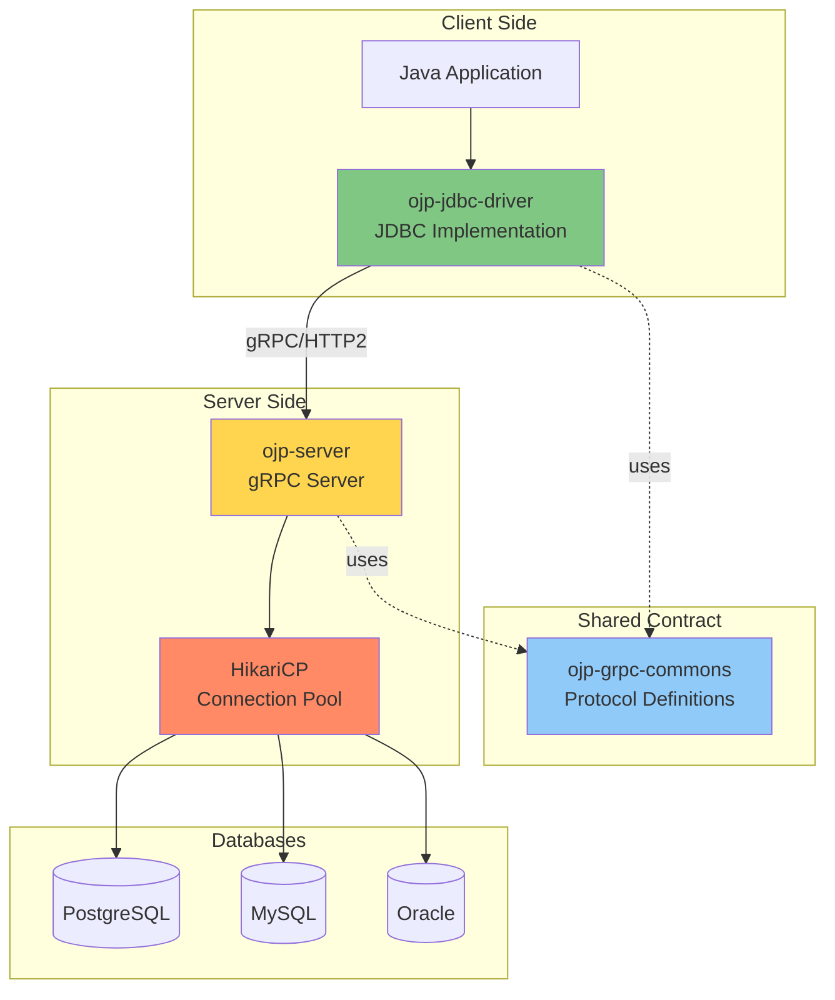

### ojp-server: The gRPC Server

**[IMAGE PROMPT 1]**: Create a detailed component diagram of ojp-server showing:
- gRPC Server endpoint (port 1059)
- HikariCP Connection Pool Manager
- Multiple database pools (PostgreSQL, MySQL, Oracle)
- Request Handler threads
- Metrics/Telemetry collector (Prometheus on port 9159)
- Configuration manager
Use a layered architecture style with clear component boundaries
Professional enterprise architecture diagram with icons and labels

The **ojp-server** is the heart of the OJP system. It's a standalone gRPC server that manages database connections and executes SQL operations on behalf of client applications.

**Key Responsibilities**:

1. **gRPC Service**: Listens for client requests over gRPC (default port: 1059)
2. **Connection Pool Management**: Maintains HikariCP pools for each configured database
3. **SQL Execution**: Executes queries and updates against real database connections
4. **Session Management**: Tracks client sessions and their transactional state
5. **Telemetry**: Exports metrics via Prometheus (default port: 9159)
6. **Security**: Enforces IP whitelisting and access controls

**Architecture Layers**:

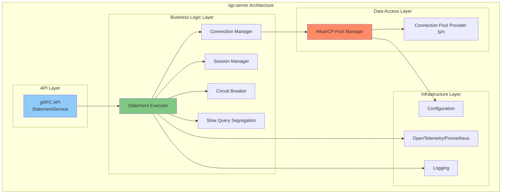

**Deployment Options**:
- **Docker Container**: Pre-built images with open-source drivers included
- **Runnable JAR**: Standalone executable with external driver support
- **Kubernetes**: Helm charts for cloud-native deployment

**Configuration**: Server behavior is controlled through environment variables or JVM system properties:

```properties
# Core Server Settings
ojp.server.port=1059
ojp.prometheus.port=9159
ojp.server.threadPoolSize=200
ojp.server.maxRequestSize=4194304

# Security
ojp.server.allowedIps=0.0.0.0/0

# Connection Management
ojp.server.connectionIdleTimeout=30000
ojp.server.circuitBreakerTimeout=60000
```

### ojp-jdbc-driver: The JDBC Implementation

**[IMAGE PROMPT 2]**: Create a layered diagram showing:
TOP: Standard JDBC interfaces (Connection, Statement, ResultSet, PreparedStatement)
MIDDLE: OJP implementations (OjpConnection, OjpStatement, OjpResultSet)
BOTTOM: gRPC Client communicating with OJP Server
Show how JDBC methods map to gRPC calls
Use UML-style class diagram with interfaces and implementations
Professional technical diagram style

The **ojp-jdbc-driver** is a complete JDBC 4.2 specification implementation that applications use as a drop-in replacement for traditional JDBC drivers.

**Key Responsibilities**:

1. **JDBC Compliance**: Implements all required JDBC interfaces
2. **Virtual Connections**: Provides lightweight connection objects
3. **gRPC Client**: Communicates with ojp-server over gRPC
4. **Result Streaming**: Handles result set streaming efficiently
5. **Transaction Management**: Manages transaction state across the network
6. **Multi-node Support**: Connects to multiple OJP servers for high availability

**JDBC Implementation Mapping**:

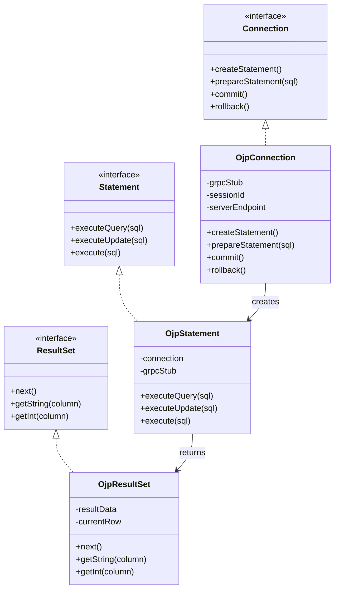

**Maven Dependency**:

```xml
<dependency>
    <groupId>org.openjproxy</groupId>
    <artifactId>ojp-jdbc-driver</artifactId>
    <version>0.3.1-beta</version>
</dependency>
```

**Usage Example**:

```java
// Load the OJP JDBC driver
Class.forName("org.openjproxy.jdbc.Driver");

// Connect with OJP URL format
String url = "jdbc:ojp[localhost:1059]_postgresql://localhost:5432/mydb";
Connection conn = DriverManager.getConnection(url, "user", "password");

// Use standard JDBC operations
Statement stmt = conn.createStatement();
ResultSet rs = stmt.executeQuery("SELECT * FROM users");

while (rs.next()) {
    System.out.println(rs.getString("username"));
}

rs.close();
stmt.close();
conn.close();
```

**Important Consideration**: When using OJP, you must **disable** any existing application-level connection pooling (HikariCP, C3P0, DBCP2) as it creates double-pooling and defeats OJP's purpose.

### ojp-grpc-commons: Shared Contracts

**[IMAGE PROMPT 3]**: Create a diagram showing Protocol Buffers (.proto files) in the center, with arrows pointing to:
LEFT: Java generated classes for ojp-jdbc-driver
RIGHT: Java generated classes for ojp-server
Show the contract acting as a bridge/shared language
Include sample proto message definitions (StatementRequest, ResultSetResponse)
Use professional technical documentation style

The **ojp-grpc-commons** module contains the gRPC service definitions and Protocol Buffer message schemas shared between the driver and server.

**Key Components**:

1. **Service Definitions**: gRPC service interfaces (`.proto` files)
2. **Message Schemas**: Request and response message structures
3. **Generated Code**: Java classes auto-generated from proto definitions
4. **Version Compatibility**: Ensures driver and server speak the same protocol

**Protocol Buffer Example**:

```protobuf
// Simplified example of protocol definition
service StatementService {
  rpc ExecuteQuery(StatementRequest) returns (stream ResultSetResponse);
  rpc ExecuteUpdate(StatementRequest) returns (UpdateResponse);
  rpc CreateSession(SessionRequest) returns (SessionResponse);
  rpc Commit(TransactionRequest) returns (TransactionResponse);
}

message StatementRequest {
  string session_id = 1;
  string sql = 2;
  repeated Parameter parameters = 3;
  int32 fetch_size = 4;
}

message ResultSetResponse {
  repeated Row rows = 1;
  ColumnMetadata metadata = 2;
  bool has_more = 3;
}
```

**Why This Matters**: The shared contract ensures type safety and version compatibility. Both driver and server are compiled against the same proto definitions, preventing protocol mismatches.

---

## 2.2 Communication Protocol

OJP uses **gRPC** (Google Remote Procedure Call) as its communication protocol, providing high-performance, low-latency communication between the driver and server.

### Why gRPC?

**[IMAGE PROMPT 4]**: Create a comparison infographic:
Traditional REST/JSON vs gRPC/Protocol Buffers
Show metrics: Latency, Throughput, Payload Size, Connection Efficiency
Use bar charts or comparison cards
Highlight gRPC advantages: HTTP/2, Binary encoding, Streaming, Type safety
Professional infographic style with clear data visualization

From the Architectural Decision Record (ADR-002):

> "gRPC's HTTP/2 transport enables multiplexed streams and low-latency communication, aligning perfectly with the project's scalability goals."

**Key Advantages**:

1. **HTTP/2 Multiplexing**: Multiple requests over a single TCP connection
2. **Binary Protocol**: Smaller payload sizes than JSON
3. **Streaming Support**: Bi-directional streaming for large result sets
4. **Type Safety**: Protocol Buffers provide compile-time type checking
5. **Language Agnostic**: Easy to implement clients in other languages
6. **Performance**: Significantly faster than REST/JSON

**Protocol Comparison**:

| Feature | REST/JSON | gRPC/Protobuf |
|---------|-----------|---------------|
| Transport | HTTP/1.1 | HTTP/2 |
| Encoding | Text (JSON) | Binary |
| Payload Size | Large | Small (60-80% reduction) |
| Streaming | Workarounds | Native support |
| Type Safety | Runtime | Compile-time |
| Performance | Good | Excellent |

### Request-Response Flow

**[IMAGE PROMPT 5]**: Create a detailed sequence diagram showing:
1. Application calls executeQuery()
2. OJP Driver serializes to protobuf
3. gRPC call over HTTP/2
4. OJP Server deserializes
5. Server acquires pool connection
6. SQL executed on database
7. Results serialized to protobuf
8. Streamed back via gRPC
9. Driver deserializes
10. Returns to application
Use professional sequence diagram style with clear swim lanes and timing indicators

Let's trace a complete SQL query execution:

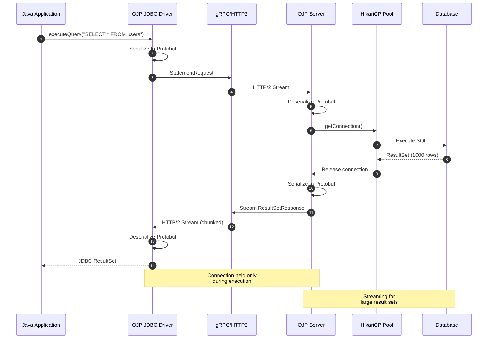

**Key Observations**:

- **Step 1-3**: Request serialization and transmission (~1-2ms)
- **Step 4-7**: Database operation execution (depends on query)
- **Step 8-10**: Result streaming and deserialization (~2-5ms for 1000 rows)
- **Connection Held**: Only during steps 6-7 (actual SQL execution)
- **Total Network Overhead**: ~5-10ms (much less than database operation time)

### Session Management

**[IMAGE PROMPT 6]**: Create a diagram showing:
LEFT: Multiple application threads/requests
CENTER: Session Manager maintaining session state (sessionId, transaction state, isolation level)
RIGHT: Server-side resources (connections, prepared statements)
Show how sessionId maps requests to resources
Use professional system architecture diagram style

Sessions maintain state across multiple requests:

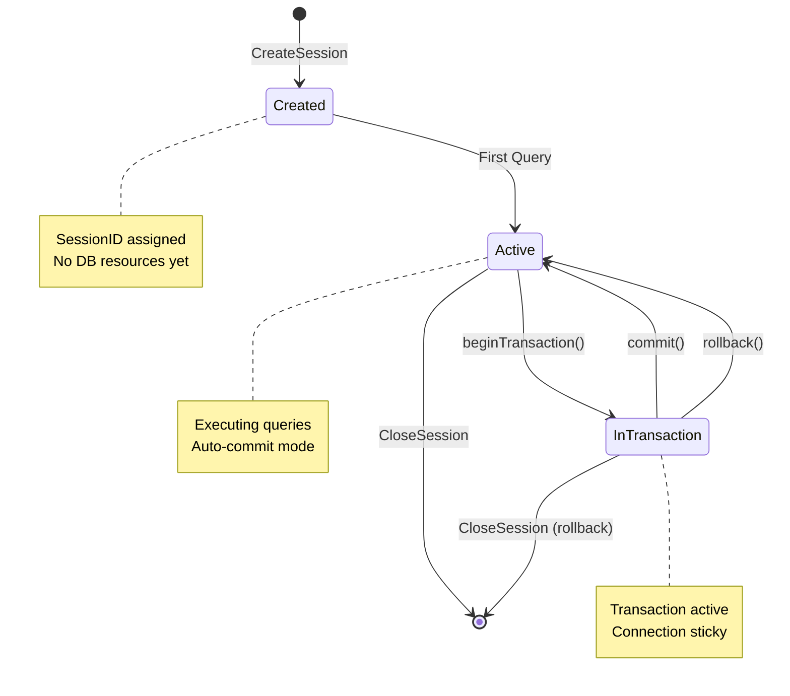

**Session Features**:
- **Unique Session ID**: Each connection gets a UUID
- **Transaction State**: Tracks commit/rollback status
- **Prepared Statements**: Cached at server side for reuse
- **Isolation Level**: Maintains JDBC isolation level settings
- **Connection Affinity**: In multi-node deployments, sessions stick to their server

### Connection Multiplexing

**[IMAGE PROMPT 7]**: Create a technical diagram showing:
Multiple JDBC operations from different threads
All multiplexed over a single gRPC channel (HTTP/2 connection)
Show concurrent streams within the single TCP connection
Label: "10 concurrent queries" → "1 TCP connection" → "10 database operations"
Use network diagram style with clear connection visualization

One of gRPC's killer features is connection multiplexing:

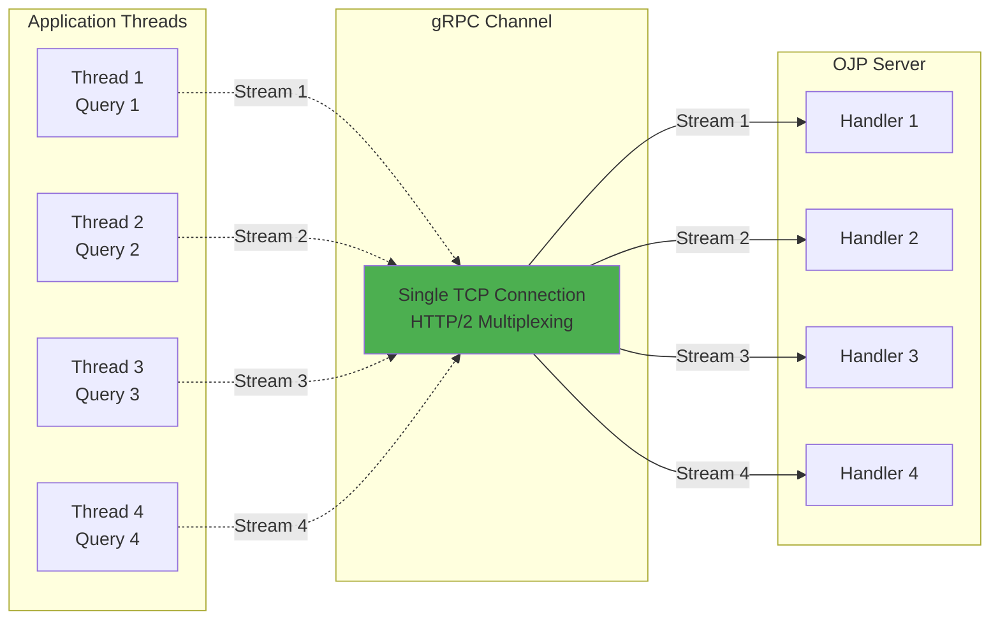

**Benefits**:
- **Reduced Overhead**: One TCP connection instead of many
- **Better Performance**: Less connection establishment overhead
- **Resource Efficiency**: Fewer sockets and file descriptors
- **Concurrent Operations**: Multiple queries in flight simultaneously

---

## 2.3 Connection Pool Management

At the core of OJP's efficiency is its use of **HikariCP**, the fastest JDBC connection pool available.

### Why HikariCP?

**[IMAGE PROMPT 8]**: Create a performance comparison chart:
Show HikariCP vs other connection pools (C3P0, DBCP, Tomcat Pool)
Metrics: Throughput (ops/sec), Latency (ms), Memory usage
Bar chart or radar chart showing HikariCP's superiority
Include quote: "HikariCP is the fastest JDBC connection pool"
Professional data visualization style

From the Architectural Decision Record (ADR-003):

> "HikariCP is the fastest JDBC connection pool, with extensive configuration options and a proven track record in high-performance systems."

**HikariCP Advantages**:
- **Speed**: 2-10x faster than alternatives in benchmarks
- **Reliability**: Extensively tested in production environments
- **Low Overhead**: Minimal memory and CPU footprint
- **Smart Defaults**: Works great out-of-the-box
- **Active Development**: Well-maintained and supported

**Performance Metrics** (from HikariCP benchmarks):

| Pool | Operations/sec | Avg Latency |
|------|----------------|-------------|
| HikariCP | 45,000 | 0.9ms |
| Tomcat | 23,000 | 1.8ms |
| C3P0 | 18,000 | 2.3ms |
| DBCP2 | 20,000 | 2.1ms |

### Pool Sizing and Configuration

**[IMAGE PROMPT 9]**: Create an infographic showing optimal pool sizing:
Show relationship between: # of cores, # of concurrent queries, optimal pool size
Include the formula: connections = ((core_count * 2) + effective_spindle_count)
Visualize with server icons, CPU cores, and database connections
Professional technical infographic style

OJP Server manages separate HikariCP pools for each database:

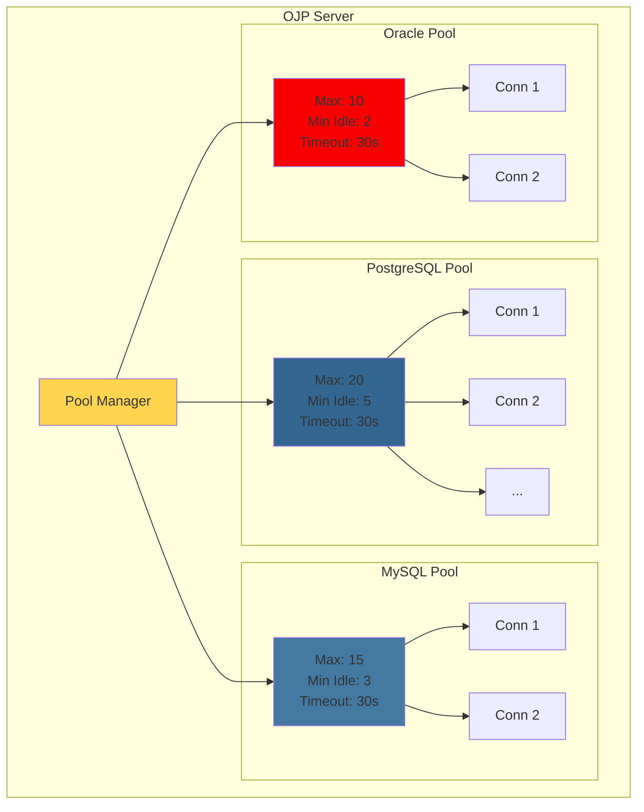

**Key Configuration Parameters**:

```properties
# Maximum pool size (most important setting)
maximumPoolSize=20

# Minimum idle connections (kept ready)
minimumIdle=5

# Connection timeout (wait for available connection)
connectionTimeout=30000

# Idle timeout (close unused connections)
idleTimeout=600000

# Max lifetime (force connection refresh)
maxLifetime=1800000

# Validation query (test connections)
connectionTestQuery=SELECT 1
```

**Pool Sizing Guidelines**:

A common formula for pool sizing:
```
connections = ((core_count * 2) + effective_spindle_count)
```

For modern SSDs (effectively infinite spindles):
```
connections = core_count * 2
```

**Example**: For a database server with 8 cores:
- Optimal pool size: 16-20 connections
- This handles concurrent queries efficiently without overwhelming the database

### Connection Abstraction Layer

**[IMAGE PROMPT 10]**: Create an architecture diagram showing:
TOP: OJP Server using ConnectionPoolProvider interface
MIDDLE: Provider SPI layer (abstraction)
BOTTOM: Multiple implementations (HikariCP, DBCP2, Custom)
Show pluggable architecture with different providers
UML-style interface diagram showing polymorphism
Professional software architecture diagram style

OJP includes a **Connection Pool Provider SPI** (Service Provider Interface) that abstracts the underlying connection pool implementation:

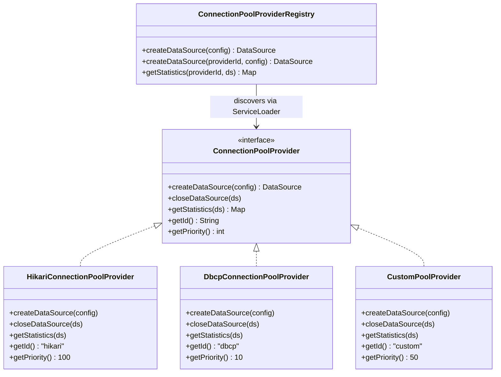

**Benefits of Abstraction**:
- **Flexibility**: Switch connection pool implementations without code changes
- **Extensibility**: Add custom pool providers via SPI
- **Testing**: Easy to mock for unit tests
- **Future-Proofing**: Adapt to new pool technologies as they emerge

**Available Providers**:

| Provider | ID | Priority | Use Case |
|----------|----|---------:|----------|
| HikariCP | `hikari` | 100 | Default, high-performance |
| Apache DBCP2 | `dbcp` | 10 | Alternative, feature-rich |
| Custom | user-defined | varies | Specialized requirements |

The provider with the highest priority is used by default, but you can explicitly specify a provider:

```java
// Default (highest priority - HikariCP)
DataSource ds = ConnectionPoolProviderRegistry.createDataSource(config);

// Explicit provider selection
DataSource ds = ConnectionPoolProviderRegistry.createDataSource("dbcp", config);
```

### Pool Provider SPI

The SPI allows organizations to plug in their own connection pool implementations:

**Example Custom Provider**:

```java
public class MyCustomPoolProvider implements ConnectionPoolProvider {
    
    @Override
    public String getId() {
        return "mypool";
    }
    
    @Override
    public int getPriority() {
        return 50; // Between hikari (100) and dbcp (10)
    }
    
    @Override
    public DataSource createDataSource(PoolConfig config) {
        // Create and configure your custom pool
        MyCustomPool pool = new MyCustomPool();
        pool.setUrl(config.getUrl());
        pool.setMaxConnections(config.getMaxPoolSize());
        return pool;
    }
    
    @Override
    public boolean isAvailable() {
        try {
            Class.forName("com.example.MyCustomPool");
            return true;
        } catch (ClassNotFoundException e) {
            return false;
        }
    }
}
```

Register via ServiceLoader:
```
META-INF/services/org.openjproxy.datasource.ConnectionPoolProvider
com.example.MyCustomPoolProvider
```

This architecture makes OJP adaptable to specialized requirements while maintaining HikariCP as the proven, high-performance default.

---

## 2.4 Architecture Diagrams

### Complete System Architecture

**[IMAGE PROMPT 11]**: Create a comprehensive end-to-end architecture diagram showing:
- Application layer (multiple instances)
- OJP JDBC Driver layer
- Network layer (gRPC/HTTP2)
- OJP Server layer (with all internal components)
- Connection Pool layer (HikariCP with multiple DB pools)
- Database layer (multiple databases)
Include all protocols, ports, and data flows
Use professional enterprise architecture poster style
Large, detailed, suitable for printing

Here's the complete OJP architecture from end to end:

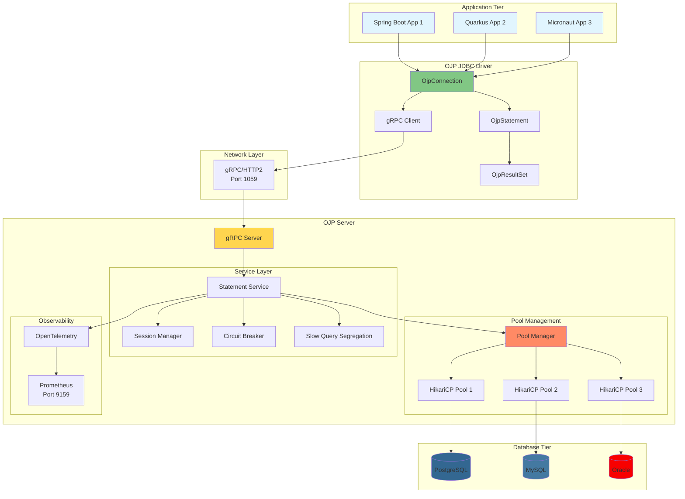

### Component Interaction

**[IMAGE PROMPT 12]**: Create a detailed component interaction diagram showing:
- How components communicate
- What data flows between them
- Key interfaces and contracts
- Configuration and dependencies
Use UML component diagram notation
Professional software architecture documentation style

Let's examine how components interact during a typical database operation:

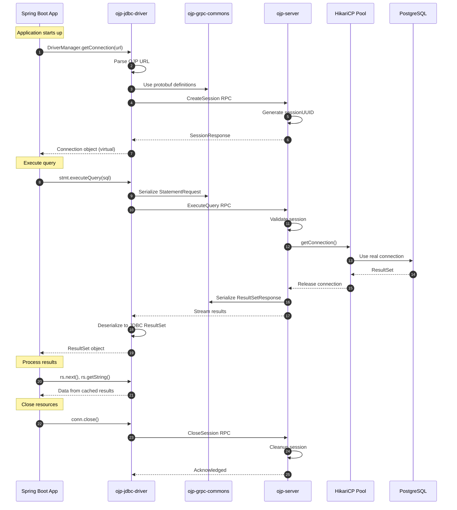

### Data Flow Diagram

**[IMAGE PROMPT 13]**: Create a data flow diagram (DFD) showing:
- External entities (Applications, Databases, Monitoring systems)
- Processes (OJP Driver, OJP Server, Connection Pools)
- Data stores (Session cache, Prepared statement cache, Metrics)
- Data flows (SQL queries, Result sets, Metrics, Configuration)
Use standard DFD notation with appropriate symbols
Professional systems analysis diagram style

The flow of data through the OJP system:

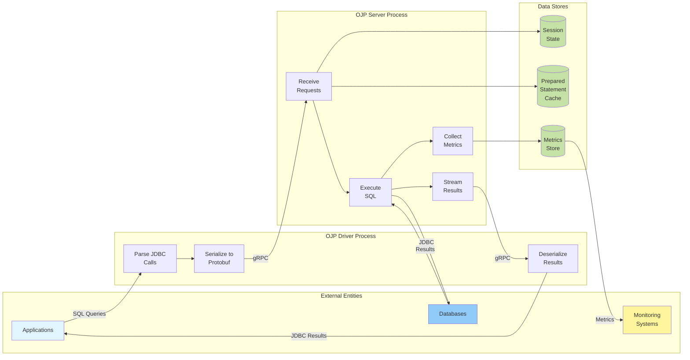

---

## Summary

OJP's architecture is built on three core components working in harmony:

1. **ojp-jdbc-driver**: A complete JDBC implementation that provides virtual connections and communicates via gRPC
2. **ojp-server**: A gRPC server managing HikariCP connection pools and executing SQL operations
3. **ojp-grpc-commons**: Shared Protocol Buffer contracts ensuring type-safe communication

The use of **gRPC** enables high-performance, low-latency communication with HTTP/2 multiplexing, while **HikariCP** provides industry-leading connection pool performance. The modular architecture with the **Connection Pool Provider SPI** ensures flexibility and extensibility.

This architecture enables OJP to deliver on its promise: **elastic scalability without proportional database connection growth**, all while maintaining JDBC compliance and requiring minimal application changes.

In the next chapter, we'll walk through a hands-on Quick Start Guide, getting OJP up and running in your environment in under 5 minutes.

---

**Previous Chapter**: [← Chapter 1: Introduction to OJP](part1-chapter1-introduction.md)  
**Next Chapter**: [Chapter 3: Quick Start Guide →](part1-chapter3-quickstart.md)
