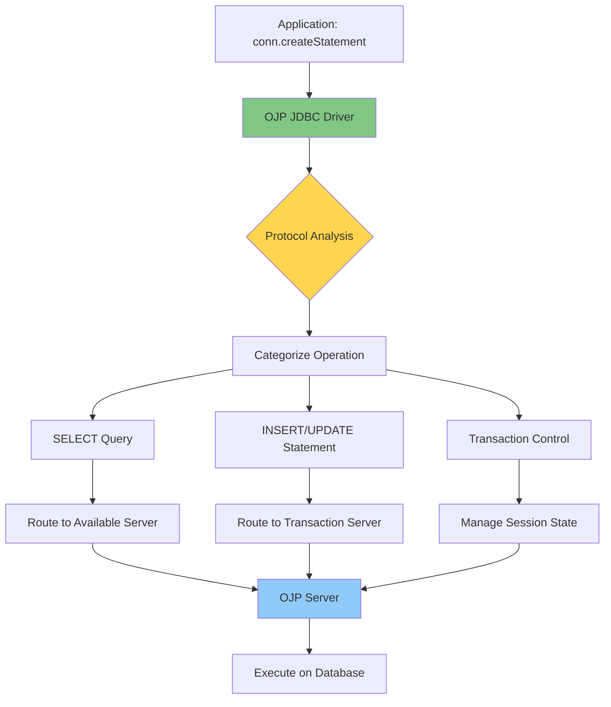
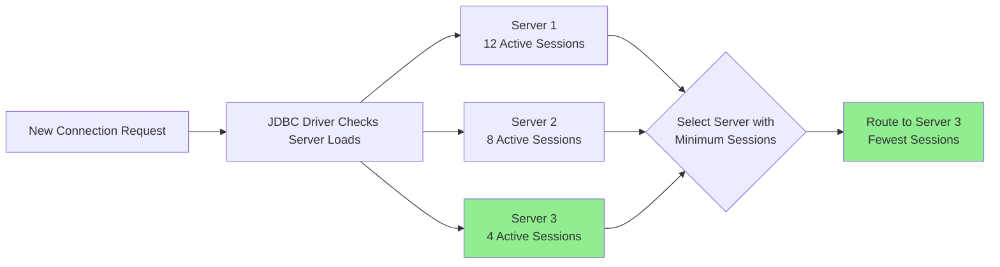
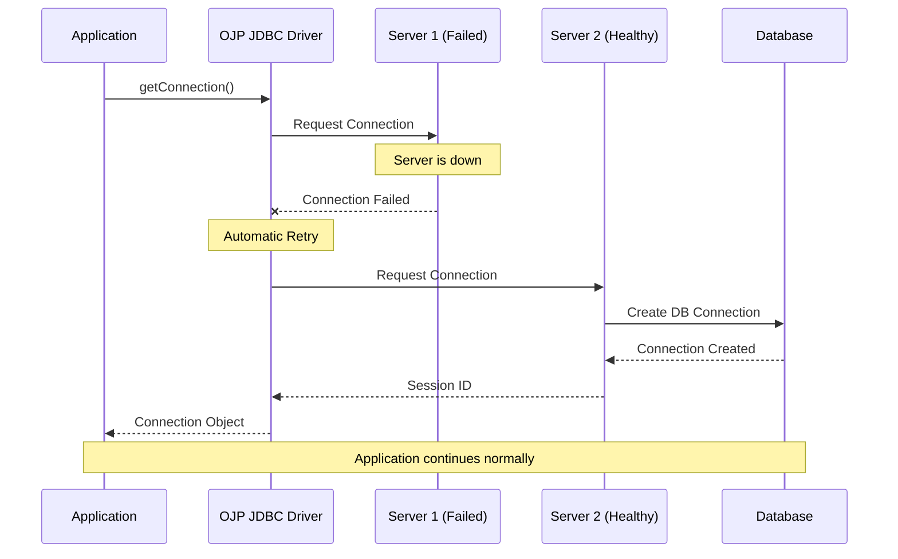

# Chapter 2a: OJP as Smart Load Balancer and Automatic Failover Mechanism

> **Chapter Overview**: This chapter explains how OJP's JDBC driver architecture provides intelligent load balancing and automatic failover capabilities that surpass traditional database proxies. You'll understand why OJP's client-side, protocol-aware approach offers unique advantages for modern distributed applications.

---

## Introduction: Beyond Traditional Database Proxies

When architects think about database high availability and load distribution, they often reach for well-known solutions like PgPool-II, ProxySQL, or HAProxy. These tools have served the industry well for years, providing connection pooling, read/write splitting, and basic failover capabilities. But they were designed for a different era—one where applications were monolithic, deployments were static, and the database tier was a carefully managed set of physical servers.

Open J Proxy takes a fundamentally different approach. Rather than operating as a separate network proxy that sits between your application and database, OJP embeds intelligence directly into your application's JDBC driver. This JDBC driver-based architecture, combined with OJP's protocol awareness, enables capabilities that traditional proxies simply cannot match: **client-side load balancing with real-time load awareness, automatic failover with transaction semantics, and zero-latency routing decisions**.

> **AI Image Prompt**: Create a comparison diagram showing two architectures side by side. LEFT: "Traditional Proxy Architecture" - show applications connecting through a network proxy box (labeled "PgPool/ProxySQL/HAProxy") which connects to databases. The proxy is a potential bottleneck and single point of failure. RIGHT: "OJP Architecture" - show applications with embedded JDBC drivers connecting directly to multiple OJP servers (no intermediate proxy), which connect to databases. Highlight the distributed nature with arrows showing client-side load balancing. Use professional architecture diagram style with clear visual distinction between the two approaches.

This chapter explores what makes OJP's approach "smart"—how it goes beyond simple connection proxying to provide intelligent, adaptive behavior that scales with modern cloud-native applications.

---

## 2a.1 Understanding OJP's Unique Architecture

### Type 3 JDBC Driver: Application-Level Intelligence

Traditional database proxies operate at the network level (Layer 4 TCP or Layer 7 HTTP), acting as intermediaries that forward traffic between applications and databases. They're external to your application—separate processes, often on separate servers, requiring additional infrastructure and network hops.

OJP, in contrast, is a **Type 3 JDBC driver**. This means it's a library that becomes part of your application's runtime. When your application calls `DriverManager.getConnection()`, the OJP driver handles that request directly, making intelligent decisions about where to route it. There's no external proxy to configure, no additional network hop for every query, and no separate infrastructure to manage.

The Type 3 architecture provides three fundamental advantages:

**Direct Integration**: The driver runs in your application's JVM, with direct access to the application's context. It knows when you start a transaction, when you execute a query, and when you commit or rollback. This semantic awareness enables intelligent routing decisions that respect transaction boundaries—something external proxies struggle with.

**Client-Side Load Balancing**: Each application instance makes its own routing decisions based on its view of server health and load. This distributes the decision-making load across all application instances rather than centralizing it in a proxy that can become a bottleneck. When you scale from 10 to 100 application instances, the load balancing capacity scales with it automatically.

**Zero Additional Network Latency**: External proxies add network round-trips—your request goes from application to proxy, then proxy to database, then back through proxy to application. With OJP's embedded driver, the only network communication is between the driver and the OJP server, which holds the actual database connections. For query-intensive workloads, eliminating that proxy hop can save milliseconds per query, which accumulates significantly at scale.

> **AI Image Prompt**: Create a layered architecture diagram showing OJP's position in the application stack. From top to bottom: "Application Code" → "OJP JDBC Driver (Type 3)" → "gRPC/HTTP2 Protocol" → "OJP Server" → "HikariCP Connection Pool" → "Database". Highlight that the JDBC driver is embedded within the application's JVM boundary (shown as a dotted box around Application Code and JDBC Driver). Use technical architecture style with clear layer separation.

### Layer 7 Protocol Awareness

Being a JDBC driver means OJP operates at Layer 7—the application protocol layer. Unlike Layer 4 TCP proxies that only see raw network packets, OJP understands JDBC operations. It knows the difference between a SELECT query and an UPDATE statement. It understands prepared statements, result sets, and transaction boundaries.

This protocol awareness enables sophisticated features:

**Transaction-Aware Routing**: OJP maintains session stickiness within transactions. When you start a transaction, all subsequent operations in that transaction go to the same OJP server and the same backend database connection. This guarantees ACID properties even in a multi-node deployment. Traditional TCP proxies can't do this because they don't understand where transaction boundaries begin and end.

**Query Classification**: OJP can categorize queries as fast or slow based on execution patterns. This enables the Slow Query Segregation feature (covered in Chapter 8), where slow queries are isolated into dedicated connection slots to prevent them from starving fast queries. Network-level proxies lack the protocol visibility to implement such features.

**Semantic Error Handling**: When a database connection fails mid-transaction, OJP knows the transaction's state and can provide appropriate error messages to the application. It can distinguish between retriable errors (like transient network failures) and fatal errors (like constraint violations), enabling intelligent retry logic.



### The OJP Server: Smart Connection Manager

While the JDBC driver provides client-side intelligence, the OJP Server provides the server-side connection management. Each OJP Server instance maintains HikariCP connection pools for your databases, manages sessions, and executes SQL operations.

The key insight is that OJP Servers are **stateless for routing decisions** but **stateful for sessions**. The driver decides which server receives each request (stateless routing), but once a session is established—especially within a transaction—that session remains bound to its server (stateful session management).

This design allows horizontal scaling of OJP Servers. When you need more capacity, you deploy additional server instances. The JDBC drivers automatically discover and use them. There's no master-slave relationship, no leader election, and no cluster state to synchronize. Each server is independent, which simplifies deployment and eliminates entire classes of distributed system problems.

---

## 2a.2 Smart Load Balancing: Beyond Round-Robin

Traditional load balancers use simple algorithms like round-robin (distribute requests sequentially across servers) or random selection. These approaches work adequately for stateless HTTP requests but fall short for database connections, which are long-lived and stateful.

### Load-Aware Server Selection

OJP implements **load-aware server selection**, where routing decisions consider the actual current load on each OJP Server. The JDBC driver maintains a client-side view of how many active sessions each server is handling. When establishing a new connection, the driver routes to the server with the fewest active sessions.

This approach adapts automatically to varying workloads:

**Long-Running Queries**: Suppose Server 1 is executing several long-running analytical queries while Servers 2 and 3 handle quick transactional queries. Server 1's session count remains high because those queries haven't completed yet. The driver directs new connections to Servers 2 and 3, preventing Server 1 from becoming even more overloaded. With round-robin, Server 1 would continue receiving connections simply because it's "next," exacerbating the imbalance.

**Natural Rebalancing**: When long-running queries complete, Server 1's session count drops, making it attractive again for new connections. No manual intervention or configuration is needed—the system self-balances based on actual observed load.

**Adaptive Scaling**: If you add a fourth OJP Server to a three-server cluster, it immediately starts receiving connections because it has zero active sessions. The driver doesn't need reconfiguration—it simply recognizes the new server from the JDBC URL and begins routing to it.



**Real-Time Adaptation**: Load-aware selection happens at connection request time, not when the URL is parsed. This means the driver continuously adapts to changing conditions. If a server experiences temporary slowness (perhaps due to garbage collection or a noisy neighbor in a cloud environment), it accumulates sessions and becomes less attractive for new requests. When the slowness resolves, it naturally receives more traffic again.

### Connection-Level Granularity

Unlike external load balancers that distribute at the network connection level (TCP stream), OJP's driver distributes at the JDBC connection level (application-level connection). This distinction matters significantly.

Consider a scenario where an application creates a connection, executes 1,000 queries, then closes the connection. With an external TCP load balancer, that entire sequence—all 1,000 queries—goes to whichever server received the initial TCP connection. If queries have varying execution times, you can end up with severe imbalance even with round-robin.

With OJP, each JDBC connection request is a new routing decision. If your application opens 1,000 connections (perhaps across many transactions), those 1,000 routing decisions distribute load based on current server state. The granularity is finer, and the distribution is more even.

### Configuration: Defaults Are Smart

Load-aware selection is enabled by default in OJP because it provides the best behavior for nearly all workloads. The configuration property is:

```properties
# Enable load-aware server selection (default: true, strongly recommended)
ojp.loadaware.selection.enabled=true
```

You can disable it to fall back to round-robin behavior, but this is rarely advisable. The only scenarios where you might disable load-aware selection are:

- **Debugging**: You're troubleshooting and want deterministic, predictable routing to isolate a problem.
- **Specific Requirements**: You have unusual infrastructure where connection counts don't correlate with load (rare).

For production deployments, leave load-aware selection enabled. It's one of OJP's key advantages over simpler proxying solutions.

---

## 2a.3 Automatic Failover: Resilience Built In

High availability requires more than just load distribution—it requires graceful handling of failures. OJP's automatic failover capabilities ensure your application continues operating even when individual OJP Servers become unavailable.

### Multi-Server Configuration

To enable automatic failover, you configure multiple OJP Servers in your JDBC URL. Instead of a single `host:port`, you provide a comma-separated list:

```java
// Single server (no failover)
String url = "jdbc:ojp[db-proxy.example.com:1059]_postgresql://localhost:5432/mydb";

// Multi-server with automatic failover
String url = "jdbc:ojp[proxy1.example.com:1059,proxy2.example.com:1059,proxy3.example.com:1059]" +
             "_postgresql://localhost:5432/mydb";
```

From your application's perspective, this is still just a JDBC URL. The `DriverManager.getConnection()` call works identically. The complexity of managing multiple servers and handling failures is entirely within the driver.

### Failure Detection and Retry

When an OJP Server fails—perhaps due to network issues, process crash, or server maintenance—the JDBC driver detects the failure and automatically retries with another healthy server.

**Health Checking**: The driver periodically checks server health using lightweight gRPC health check RPCs. Servers that fail health checks are temporarily marked as unhealthy and excluded from new connection routing.

**Transparent Retry**: If a connection request fails (server unreachable, timeout, or gRPC error), the driver automatically retries with another server from the list. This happens transparently—your application just sees a successful connection after a slight delay, or an error if all servers are unavailable.

**Session Awareness**: For idle connections (not in a transaction), failover is transparent. For active connections within a transaction, failover cannot preserve transaction state (since the transaction exists on a specific backend database connection). In this case, the application receives an error and must retry the transaction. This behavior is correct and expected—ACID guarantees cannot survive a mid-transaction server failure without distributed transaction coordination.

> **AI Image Prompt**: Create a sequence diagram showing failover process. Show: 1) Application requests connection from Driver, 2) Driver sends request to Server 1 (marked with red X - failed), 3) Driver detects failure (timeout or error), 4) Driver retries with Server 2 (green checkmark - success), 5) Connection established and returned to application. Use timeline-style sequence diagram with clear success/failure indicators.



### Recovery and Rebalancing

When a failed server recovers, the driver automatically starts using it again. This happens gradually through the normal load-aware selection process:

1. The recovered server passes health checks and is marked healthy again
2. Its session count is low (it hasn't been receiving traffic)
3. Load-aware selection routes new connections to it (it's the least loaded)
4. Traffic gradually increases as new connections are established
5. Balance is restored across all servers

There's no "thundering herd" where all connections immediately rush to the recovered server. The gradual recovery prevents overwhelming a server that might have just restarted after an issue.

### Comparison with Traditional Proxy Failover

Traditional database proxies handle failover differently, and understanding the differences highlights OJP's advantages:

**PgPool-II and ProxySQL** implement failover at the database backend level—they detect when a database primary fails and switch to a replica. This is orthogonal to OJP's failover. OJP handles failures of the proxy tier itself (OJP Servers), while PgPool/ProxySQL handle database tier failures. You can use both: OJP Servers for proxy tier HA, and database replication for database tier HA.

**HAProxy and Network Load Balancers** provide TCP-level failover—when a backend server stops responding to TCP connections, they route to healthy backends. However, they don't understand JDBC semantics. If a server fails mid-transaction, HAProxy simply routes the next TCP packet to a different server, which may not have the transaction context. OJP understands transactions and handles the error correctly, informing the application that the transaction must be retried.

**Client-Side vs Server-Side**: Most traditional proxy failover is server-side—the proxy decides which backend is healthy and routes accordingly. OJP's failover is client-side—each application instance makes its own failover decisions. This distributes the failure detection and recovery logic, eliminating the proxy as a single point of failure in the failover mechanism itself.

---

## 2a.4 Comparing OJP with Traditional Database Proxies

To understand when and why to choose OJP over traditional solutions, let's compare it directly with popular database proxy tools across key dimensions.

### Comparison Table: OJP vs Traditional Database Proxies

| Capability | OJP | PgPool-II | ProxySQL | HAProxy | MySQL Router |
|------------|-----|-----------|----------|---------|--------------|
| **Architecture** | Type 3 JDBC Driver + Server | External Proxy | External Proxy | External TCP Proxy | External Proxy |
| **Deployment** | Embedded in Application | Separate Infrastructure | Separate Infrastructure | Separate Infrastructure | Separate Infrastructure |
| **Protocol Layer** | Layer 7 (JDBC/SQL) | Layer 7 (PostgreSQL) | Layer 7 (MySQL) | Layer 4 (TCP) | Layer 7 (MySQL) |
| **Load Balancing** | Client-side, Load-aware | Server-side, Round-robin | Server-side, Configurable | Server-side, Various algorithms | Server-side, Round-robin |
| **Failover Mechanism** | Automatic, Client-driven | Automatic, Watchdog-based | Automatic, Health checks | Automatic, TCP health checks | Automatic, Health checks |
| **Transaction Awareness** | Full JDBC semantics | PostgreSQL protocol | MySQL protocol | None (TCP level) | MySQL protocol |
| **Connection Pooling** | Server-side (HikariCP) | Built-in | Built-in | None | None |
| **Database Support** | Any JDBC database | PostgreSQL only | MySQL/MariaDB only | Any TCP service | MySQL only |
| **Read/Write Splitting** | Application-level | Built-in | Built-in | Configuration-based | Built-in |
| **Query Routing** | Protocol-aware | Protocol-aware | Rule-based, protocol-aware | Not applicable | Basic routing |
| **Slow Query Handling** | Segregation (Chapter 8) | Limited | Query caching, throttling | Not applicable | Limited |
| **Observability** | OpenTelemetry, Prometheus | Basic logging/stats | Rich stats interface | HAProxy stats | Basic stats |
| **Network Hops** | 1 (App → OJP Server) | 2 (App → Proxy → DB) | 2 (App → Proxy → DB) | 2 (App → Proxy → DB) | 2 (App → Proxy → DB) |
| **Horizontal Scaling** | Linear (add servers) | Limited (shared state) | Linear (add proxies) | Linear (add LB instances) | Linear (add routers) |
| **Single Point of Failure** | No (client-side logic) | Yes (proxy tier) | Yes (proxy tier) | Yes (LB tier) | Yes (router tier) |
| **Infrastructure Overhead** | Minimal (JVM library + servers) | Moderate (proxy VMs) | Moderate (proxy VMs) | Moderate (LB VMs) | Moderate (router VMs) |
| **License** | Apache 2.0 (Open Source) | BSD-like (Open Source) | GPLv3 (Open Source) | GPLv2/Enterprise (Open/Commercial) | GPLv2 (Open Source) |

### Key Differences Explained

#### 1. **Client-Side vs Server-Side Architecture**

This is the fundamental difference. Traditional proxies are external components—separate processes on separate infrastructure that sit in the network path between application and database. OJP embeds intelligence in the JDBC driver, making routing decisions locally within each application instance.

**Implications**:
- **Scalability**: OJP's intelligence scales with your application instances. Deploying 100 app instances means 100 independent routing decision-makers, distributing the load. Traditional proxies concentrate routing decisions in the proxy tier, which can become a bottleneck.
- **Network Topology**: Traditional proxies add a network tier. In cloud environments with VPCs, subnets, and security groups, this means additional network configuration. OJP simplifies topology—applications connect directly to OJP Servers, which connect to databases. One less tier to secure and monitor.
- **Latency**: Each network hop adds latency (typically 1-5ms in-datacenter). For query-intensive workloads executing thousands of queries per second, eliminating the proxy hop can save seconds of accumulated latency per request.

#### 2. **Database Agnosticism**

Most traditional proxies are database-specific: PgPool for PostgreSQL, ProxySQL for MySQL/MariaDB, MySQL Router for MySQL. HAProxy is database-agnostic but operates at Layer 4, lacking protocol awareness.

OJP supports **any JDBC database**: PostgreSQL, MySQL, Oracle, SQL Server, DB2, H2, MariaDB, CockroachDB, and more. Switch from PostgreSQL to Oracle? Just change the JDBC URL's database portion—OJP doesn't care. Migrate from MySQL to CockroachDB? Same connection management code continues working.

This database independence is invaluable for:
- **Polyglot Persistence**: Applications using multiple databases (e.g., PostgreSQL for transactional data, MySQL for legacy systems) use a single connection management approach.
- **Migration Projects**: Migrating databases is complex enough without rewriting connection management infrastructure. OJP abstracts away database-specific connection quirks.
- **Multi-Tenant Systems**: Different tenants might use different databases (enterprise customers on Oracle, startups on PostgreSQL). OJP handles all scenarios uniformly.

#### 3. **Transaction Semantics and Session Stickiness**

Traditional TCP load balancers like HAProxy don't understand transactions. They see a stream of bytes and route them to backends. If a backend fails mid-transaction, HAProxy might route subsequent packets to a different backend, causing cryptic errors.

Database-specific proxies like PgPool and ProxySQL understand transactions at the protocol level and maintain session stickiness. However, they're still separate processes—if the proxy itself fails, transaction state is lost.

OJP maintains session stickiness using the same protocol awareness, but because the driver logic is embedded in the application, failover decisions are made with full context of the application's transaction state. The driver knows whether you're in a transaction and can provide semantically correct error messages when failover isn't possible.

#### 4. **Load-Aware Routing**

Traditional proxies use predefined algorithms: round-robin (ProxySQL, MySQL Router), least connections (HAProxy with configuration), or random. These algorithms don't adapt to changing load patterns in real-time.

OJP's load-aware selection tracks active session counts in real-time and routes to the least-loaded server. This approach naturally handles:
- **Heterogeneous Query Loads**: Mix of fast OLTP queries and slow analytical queries
- **Resource Contention**: Temporary slowdowns on specific servers due to noisy neighbors, GC pauses, or I/O spikes
- **Elastic Scaling**: New servers automatically receive traffic proportional to their capacity

#### 5. **Observability and Integration**

Modern cloud-native applications rely on observability platforms like Prometheus, Grafana, Datadog, and New Relic. OJP provides first-class OpenTelemetry integration (Chapter 13), exporting metrics in standard formats that integrate seamlessly with your existing monitoring stack.

Traditional proxies have their own stats interfaces: PgPool has `show pool_nodes`, ProxySQL has its admin interface, HAProxy has stats pages. Integrating these into modern observability platforms requires custom exporters and configuration.

---

## 2a.5 When to Choose OJP vs Traditional Proxies

Given these differences, when should you choose OJP over traditional solutions?

### Choose OJP When:

**1. You're building cloud-native, microservices-based applications**: OJP's architecture aligns perfectly with horizontally scaled, ephemeral workloads. The client-side logic scales naturally with your application instances.

**2. You use multiple databases or expect to migrate**: OJP's database-agnostic design means one tool handles all databases. Traditional proxies lock you into specific databases.

**3. You want minimal operational overhead**: OJP eliminates the proxy tier from your infrastructure. Fewer components to deploy, secure, monitor, and troubleshoot.

**4. Your application is Java-based**: OJP is a JDBC driver—it's designed for Java applications. If you're not using Java, OJP isn't an option (though future gRPC clients for other languages could change this).

**5. You need advanced features like Slow Query Segregation**: OJP's protocol awareness enables features that network proxies cannot provide.

**6. You value latency optimization**: Eliminating the proxy network hop reduces end-to-end request latency.

### Choose Traditional Proxies When:

**1. You need database-specific features**: PgPool's online recovery, ProxySQL's query caching, or MySQL Router's read/write splitting based on database replication topology provide value beyond connection management.

**2. You're not using Java**: If your application is written in Python, Go, Ruby, or another language, you need a solution that works with those database drivers. (You could still use OJP Servers and write a thin client library, but that's advanced usage.)

**3. You need centralized policy enforcement**: Some organizations prefer centralized proxy infrastructure for security, auditing, or compliance reasons. Having a dedicated proxy tier creates a chokepoint for policy enforcement.

**4. You're already heavily invested**: If you have mature operational tooling around PgPool, ProxySQL, or HAProxy, and it's working well, migrating to OJP may not provide enough value to justify the effort.

### Can You Use Both?

Yes—OJP and traditional database proxies solve different problems and can complement each other:

- **OJP for Proxy Tier HA**: Use multinode OJP deployment (this chapter) to provide high availability and load balancing for the connection management tier.
- **Database Replication with PgPool/ProxySQL**: Use database-native replication and proxy tools to provide database tier high availability (primary/replica failover).

In this setup, OJP Servers connect to a PgPool or ProxySQL endpoint, which then connects to the database cluster. You get the benefits of OJP's client-side intelligence and database-agnostic design, plus the database-specific failover capabilities of traditional tools.

---

## 2a.6 Real-World Deployment Scenarios

Let's explore how OJP's smart load balancing and failover work in practice across common deployment patterns.

### Scenario 1: Kubernetes with Horizontal Pod Autoscaling

You have a microservice deployed in Kubernetes with Horizontal Pod Autoscaler (HPA) configured to scale from 2 to 20 pods based on CPU utilization.

**Without OJP**: Each pod connects directly to the database. When HPA scales to 20 pods, you have 20 connection pools (perhaps 10 connections each = 200 total database connections). When traffic drops and HPA scales down to 2 pods, you have 20 connections. The database sees wildly varying connection counts, making capacity planning difficult.

**With OJP**: Each pod uses a single OJP connection in the JDBC driver. You deploy 3 OJP Servers, each managing a HikariCP pool of 20 database connections (60 total). As pods scale from 2 to 20, database connections remain constant at 60. The OJP Servers absorb the application scaling. Pods distribute across the 3 OJP Servers using load-aware selection. If one OJP Server pod fails (Kubernetes recreates it), applications automatically fail over to the other 2 servers—no connection storms, no database disruption.

### Scenario 2: Multi-Region Active-Active Deployment

Your application runs in two AWS regions (us-east-1 and us-west-2) for low-latency access and disaster recovery. Each region has its database replica (primary in us-east-1, readable replica in us-west-2).

**Traditional Approach**: Use database replication and application-level routing logic to direct writes to the primary and reads to the local replica. Implement custom failover logic for when the primary fails.

**With OJP**: Deploy OJP Servers in each region. In us-east-1, OJP Servers connect to the primary database. In us-west-2, OJP Servers connect to the local replica. Applications use the JDBC URL with local OJP Servers:

```java
// us-east-1 application
String url = "jdbc:ojp[ojp-1a.internal:1059,ojp-1b.internal:1059]_postgresql://primary.rds:5432/mydb";

// us-west-2 application  
String url = "jdbc:ojp[ojp-2a.internal:1059,ojp-2b.internal:1059]_postgresql://replica.rds:5432/mydb";
```

Each region's applications connect to local OJP Servers (low latency), which connect to local databases. If an OJP Server fails in either region, applications automatically fail over to the other local OJP Server. Database-level failover (primary to replica promotion) is independent and handled by your database's replication system.

### Scenario 3: Blue-Green Deployment with Zero Downtime

You're deploying a new version of your application using blue-green deployment pattern. You want to switch traffic from the old version to the new version without dropping connections.

**Traditional Approach**: Both blue and green environments connect through the same load balancer to the same proxy. Connection handling depends on proxy behavior and connection draining configuration.

**With OJP**: Both blue and green environments use the same OJP Server URLs. Because OJP Servers are independent of application versions, you can:

1. Deploy green environment (new version), which connects to existing OJP Servers
2. Switch traffic from blue to green at load balancer
3. Green environment establishes new connections to OJP Servers (load-aware distribution)
4. Drain connections from blue environment gracefully
5. OJP Servers see a gradual shift in session counts, not a sudden spike

The database connection count remains stable throughout—OJP Servers maintain their pools regardless of which application version is connecting.

---

## 2a.7 Practical Configuration and Best Practices

To leverage OJP's smart load balancing and failover effectively, follow these configuration guidelines:

### Multi-Server JDBC URL Configuration

Always configure at least 2 OJP Servers in production for high availability:

```java
// Minimum HA configuration (2 servers)
String url = "jdbc:ojp[ojp-server-1:1059,ojp-server-2:1059]_" +
             "postgresql://db.internal:5432/proddb";

// Recommended HA configuration (3 servers)
String url = "jdbc:ojp[ojp-server-1:1059,ojp-server-2:1059,ojp-server-3:1059]_" +
             "postgresql://db.internal:5432/proddb";
```

Three servers provide better fault tolerance than two (can survive one failure with 2 healthy servers remaining) while minimizing infrastructure costs compared to more servers.

### Load-Aware Selection Configuration

Enable load-aware selection (it's enabled by default, but explicitly setting it makes intent clear):

```properties
# Enable load-aware server selection (recommended for all environments)
ojp.loadaware.selection.enabled=true
```

Disable only for debugging:

```properties
# Disable only for troubleshooting (round-robin behavior)
ojp.loadaware.selection.enabled=false
```

### Health Check Tuning

The driver performs health checks to detect failed servers. The default configuration works for most scenarios:

```properties
# Health check interval (default: 30 seconds)
ojp.healthcheck.interval.seconds=30

# Health check timeout (default: 5 seconds)
ojp.healthcheck.timeout.seconds=5

# Unhealthy threshold (consecutive failures before marking unhealthy)
ojp.healthcheck.unhealthy.threshold=3
```

For very dynamic environments (e.g., Kubernetes with aggressive pod churn), you might reduce the health check interval:

```properties
# More frequent health checks for dynamic environments
ojp.healthcheck.interval.seconds=10
```

### Connection Retry Configuration

When failover occurs, the driver retries connection requests:

```properties
# Maximum retry attempts (default: 3)
ojp.connection.retry.max=3

# Retry delay in milliseconds (default: 100ms)
ojp.connection.retry.delay.ms=100
```

These defaults provide good balance between responsiveness and avoiding excessive retry storms during outages.

### Monitoring and Alerting

Monitor these key metrics (covered in depth in Chapter 13):

- **Active Sessions per Server**: Should be roughly balanced when using load-aware selection
- **Failover Events**: Spikes indicate server instability or network issues
- **Connection Request Latency**: Increases during server failures (expected) or when servers are overloaded
- **Health Check Failures**: Sustained failures indicate a server is down

Set up alerts for:
- Any OJP Server down for > 5 minutes (indicating failure, not just restart)
- Failover rate exceeding baseline (e.g., > 10 failovers per hour)
- Connection latency p99 exceeding threshold (e.g., > 100ms)

---

## 2a.8 Chapter Summary

This chapter explored OJP's architecture as a smart load balancer and automatic failover mechanism, highlighting its advantages over traditional database proxies:

**Key Takeaways**:

1. **OJP is a Type 3 JDBC Driver**, not an external proxy. This fundamental architectural difference enables client-side intelligence, zero additional network hops, and linear scalability with application instances.

2. **Load-Aware Server Selection** distributes connections based on real-time server load, adapting automatically to heterogeneous workloads, server additions/removals, and changing conditions.

3. **Automatic Failover** handles OJP Server failures transparently for idle connections and gracefully for active transactions, maintaining high availability without manual intervention.

4. **Protocol Awareness at Layer 7** enables transaction-aware routing, query classification, and semantic error handling—capabilities that Layer 4 TCP proxies cannot provide.

5. **Database Agnosticism** means a single tool handles PostgreSQL, MySQL, Oracle, SQL Server, and any JDBC database, simplifying polyglot persistence and database migrations.

6. **Client-Side Architecture** eliminates the proxy tier as a single point of failure, distributes routing intelligence across application instances, and reduces operational overhead.

**When OJP Excels**: Cloud-native microservices, polyglot persistence, latency-sensitive applications, and environments where minimal operational overhead is valued.

**Complementary with Traditional Proxies**: OJP handles proxy tier HA and load balancing; database-native replication tools handle database tier HA. Use both for comprehensive resilience.

With these foundational concepts understood, you're ready to explore OJP's deployment and configuration (Chapter 3), advanced features like Slow Query Segregation (Chapter 8), and full multinode deployment details (Chapter 9).

---

**[IMAGE PROMPT - Chapter Summary Visual]**: Create an infographic summarizing OJP's advantages as a smart load balancer. Include 6 sections arranged in a grid: 1) "Client-Side Intelligence" with embedded driver icon, 2) "Load-Aware Routing" with balanced server diagram, 3) "Automatic Failover" with redundancy illustration, 4) "Protocol Awareness" with JDBC/SQL icons, 5) "Database Agnostic" with multiple database logos, 6) "No Network Hop Tax" with latency comparison chart. Use modern, clean infographic style with icons and minimal text. Professional color scheme with OJP branding.

---

## Related Chapters

- **[Chapter 1: Introduction](part1-chapter1-introduction.md)**: Foundational concepts about Type 3 drivers and Layer 7 proxies
- **[Chapter 2: Architecture Deep Dive](part1-chapter2-architecture.md)**: Detailed component architecture
- **[Chapter 9: Multinode Deployment](part3-chapter9-multinode-deployment.md)**: Comprehensive multinode configuration and operational details
- **[Chapter 13: Telemetry and Monitoring](part4-chapter13-telemetry.md)**: Observability for load balancing and failover events
- **[Appendix G: Troubleshooting](appendix-g-troubleshooting.md)**: Debugging failover and load balancing issues

---

**Navigation**: [← Previous: Chapter 2](part1-chapter2-architecture.md) | [Next: Chapter 3 →](part1-chapter3-quickstart.md)
