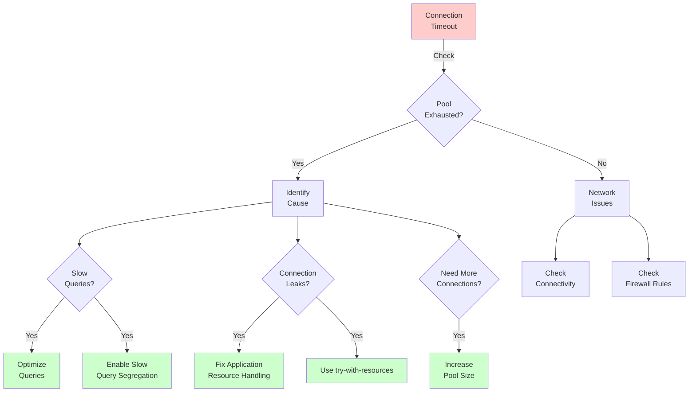

# Chapter 15: Troubleshooting

Even the most robust systems encounter issues in production. Open J Proxy aims for reliability, but database proxies sit in a complex stack where problems can originate from applications, networks, the proxy itself, or databases. This chapter equips you with diagnostic techniques and solutions for the most common problems you'll encounter.

## 15.1 Diagnostic Fundamentals

Before diving into specific issues, let's establish a systematic troubleshooting approach that applies to any OJP problem.

### The Troubleshooting Mindset

When something goes wrong with OJP, resist the urge to immediately blame the proxy. Database connectivity issues often stem from network problems, database server issues, or application misconfiguration. OJP might be the messenger reporting these problems rather than their cause.

Start by identifying symptoms precisely. "OJP doesn't work" isn't actionable, but "applications timeout after 30 seconds when executing SELECT queries" gives you something concrete to investigate. Note when the problem started, which operations fail, and whether any changes preceded the issue.

Reproduce the problem in a controlled environment if possible. Intermittent issues in production become much easier to debug when you can trigger them reliably in a test environment. Simplified reproduction—like running a single query from a JDBC test program—eliminates variables and focuses your investigation.

### Essential Diagnostic Tools

Several tools prove invaluable when troubleshooting OJP deployments.

Enable debug logging to see what OJP is actually doing. Add `-Dojp.log.level=DEBUG` to your server startup and `-Dojp.jdbc.log.level=DEBUG` to your application if you're using the JDBC driver. Debug logs reveal connection acquisition attempts, query routing decisions, and error conditions that normal logs don't show.

Network analysis tools like `tcpdump` or Wireshark help when you suspect network issues. Capture packets between your application and OJP, or between OJP and the database, to verify connectivity and inspect actual network traffic.

Database server logs often contain critical clues. If OJP reports connection failures, check whether the database rejected connections due to authentication failures, resource limits, or server configuration issues.

Prometheus metrics (Chapter 13) provide operational visibility. Check connection pool utilization, error rates, and latency metrics before assuming OJP itself has failed. High connection pool utilization might indicate slow queries rather than OJP problems.

**[AI Image Prompt: Create a troubleshooting workflow diagram showing the systematic approach to OJP issues. Display a decision tree: 1) Start with "Identify symptoms" (collect exact error messages, timing, affected operations), 2) "Can reproduce?" branch (yes=controlled test, no=production investigation), 3) "Check logs" (OJP debug logs, database logs, application logs), 4) "Check metrics" (connection pools, latency, errors), 5) "Network test" (connectivity, latency, packet loss), 6) "Isolate layer" (application, OJP, network, database). Use flowchart style with clear decision points and action boxes. Include icons for each tool/step. Style: Technical flowchart, professional, clear visual hierarchy, color-coded severity levels.]**

## 15.2 Build and Installation Issues

Getting OJP built and running correctly forms the foundation for everything else. Let's address common setup problems.

### Build Failures

When building OJP from source, Maven might fail with dependency resolution errors. The most common cause is an outdated Maven repository index. Run `mvn clean install -U` to force dependency updates. The `-U` flag tells Maven to check for updated snapshots and releases, which resolves most dependency issues.

Compilation errors mentioning gRPC or protobuf classes usually indicate the Protocol Buffer compiler hasn't generated Java code. Ensure you have `protoc` installed and accessible in your PATH. The Maven build should invoke it automatically, but you can manually trigger code generation with `mvn clean generate-sources`.

If tests fail during the build, you might be hitting database connectivity issues. OJP's test suite requires Docker to spin up test databases. Verify Docker is running and you have sufficient resources allocated (at least 4GB RAM for Docker). Some tests use Testcontainers, which needs Docker socket access—ensure your user has permission to access `/var/run/docker.sock`.

Memory errors during the build typically stem from insufficient heap space for Maven. Set `MAVEN_OPTS` to allocate more memory:

```bash
export MAVEN_OPTS="-Xmx2g -XX:MaxPermSize=512m"
mvn clean install
```

### JAR Execution Problems

When running the OJP Server JAR, "class not found" errors indicate classpath issues. The ojp-server JAR should be a fat JAR containing all dependencies. Verify you're using the correct JAR file—it's in `ojp-server/target/` and includes `-jar-with-dependencies` in the filename.

Port conflicts prevent OJP from starting when another process already uses its ports. OJP listens on port 9090 (gRPC) and 9159 (metrics) by default. Check what's using these ports:

```bash
# On Linux/Mac
lsof -i :9090
lsof -i :9159

# On Windows
netstat -ano | findstr :9090
netstat -ano | findstr :9159
```

Change OJP's ports if needed using `-Dojp.server.port=9091 -Dojp.prometheus.port=9160`.

Permission errors accessing configuration files usually mean file ownership or permissions are incorrect. Ensure the user running OJP has read access to any configuration files and write access to log directories.

### Driver Installation Issues

The JDBC driver must be accessible to your application's classloader. For Maven projects, add the dependency:

```xml
<dependency>
    <groupId>org.openjproxy</groupId>
    <artifactId>ojp-jdbc-driver</artifactId>
    <version>0.3.1-beta</version>
</dependency>
```

For non-Maven projects, download the driver JAR and add it to your application's classpath. Don't mix multiple versions of the driver in the same classloader—this causes class loading conflicts and unpredictable behavior.

Class loading issues in application servers (Tomcat, JBoss) sometimes require placing the driver in a parent classloader. For Tomcat, this means `$CATALINA_HOME/lib`. For JBoss/WildFire, consult their documentation on JDBC driver installation.

**[AI Image Prompt: Create a troubleshooting checklist infographic for OJP installation issues. Display 5 common problems as separate cards: 1) Build failures (Maven flags, protoc check, Docker requirement), 2) JAR execution (classpath verification, port conflicts, permissions), 3) Driver installation (Maven dependencies, classloader considerations), 4) Database drivers (ojp-libs directory, download script), 5) First connection (JDBC URL format, server connectivity). For each card, show problem symptoms, diagnostic commands, and solutions. Use checkmark icons for steps to verify. Style: Checklist infographic, modern flat design, organized layout, clear typography.]**

## 15.3 Connection Problems

Connection issues account for the majority of OJP troubleshooting cases. Let's systematically address them.

### Cannot Connect to OJP Server

When applications can't connect to OJP Server, start by verifying the server is actually running. Check the process exists and is listening on the expected port:

```bash
# Verify process is running
ps aux | grep ojp-server

# Check it's listening on the gRPC port
netstat -ln | grep 9090
```

If the server isn't running, check its logs for startup failures. Common startup problems include configuration errors, missing database drivers, or insufficient system resources.

Network connectivity between application and OJP requires testing. From the application host, try connecting to OJP's port:

```bash
telnet ojp-server.example.com 9090
# or
nc -zv ojp-server.example.com 9090
```

Firewall rules might block the gRPC port. Many corporate firewalls don't allow non-standard ports. Verify firewall rules permit traffic on port 9090, or configure OJP to use a different port if needed.

JDBC URL format errors prevent successful connections even when network connectivity works. The correct format is:

```
jdbc:ojp://hostname:port/database
```

Common mistakes include forgetting the `ojp://` protocol, using wrong port numbers, or including database-specific parameters that should go in the ojp.properties file instead.

### Authentication Failures

Authentication errors like "Access denied for user" actually originate from the database server, not OJP. OJP passes credentials through to the database, so authentication failures indicate either incorrect credentials or database-side permission issues.

Verify credentials work by connecting directly to the database, bypassing OJP:

```bash
# PostgreSQL
psql -h db.example.com -U myuser -d mydb

# MySQL
mysql -h db.example.com -u myuser -p mydb
```

If direct connections work but OJP connections fail, check the properties you're passing. The JDBC driver sends properties to OJP, which forwards them to the database. Ensure you're setting `user` and `password` properties correctly:

```java
Properties props = new Properties();
props.setProperty("user", "myuser");
props.setProperty("password", "mypassword");
Connection conn = DriverManager.getConnection("jdbc:ojp://localhost:9090/mydb", props);
```

Some databases require additional authentication parameters. Oracle might need `oracle.net.authentication_services=(TCPS)` for SSL authentication. PostgreSQL might require `ssl=true`. These go in the properties object, not the JDBC URL.

### Connection Pool Exhaustion

When all connections in OJP's pool are busy, new requests must wait. If they wait too long, connection timeout exceptions occur. This manifests as intermittent failures during peak load—requests succeed initially but start timing out as the pool fills.

Check connection pool metrics in Prometheus. `hikaricp_connections_active` shows busy connections, while `hikaricp_connections_idle` shows available connections. If idle connections drop to zero regularly, you've hit pool capacity.

Identify why connections aren't being released. The two most common causes:

Long-running queries hold connections for extended periods. Check your database's slow query log to identify expensive queries. Optimize them or segregate them using OJP's slow query segregation feature (Chapter 8).

Connection leaks occur when applications don't close connections, statements, or result sets properly. Always use try-with-resources in Java:

```java
try (Connection conn = dataSource.getConnection();
     PreparedStatement stmt = conn.prepareStatement(sql);
     ResultSet rs = stmt.executeQuery()) {
    // Process results
} // Connection automatically returned to pool
```

Forgotten ResultSets are particularly problematic. Even if you close the Connection, an unclosed ResultSet keeps the actual database connection busy until garbage collection runs.

Increase pool size if your application legitimately needs more concurrent connections. Edit `ojp.properties`:

```properties
# Increase maximum pool size
hikariCP.maximumPoolSize=50

# Increase minimum idle connections
hikariCP.minimumIdle=10
```

Remember that each connection consumes database resources. Don't set pool sizes arbitrarily large—size them based on measured concurrent connection needs.



### Connection Timeouts

When connections time out, you need to determine where the timeout occurs—at the JDBC driver, at OJP Server, or at the database.

JDBC driver timeouts are configured in your connection properties:

```properties
# Connection timeout in milliseconds
ojp.connection.timeout=30000

# Query timeout in seconds
queryTimeout=60
```

If connections time out before queries complete, increase `ojp.connection.timeout`. If queries themselves time out, either increase `queryTimeout` or optimize the queries.

OJP Server has its own timeout settings for backend database connections. Check `ojp-server-config.properties`:

```properties
# Maximum connection lifetime (milliseconds)
hikariCP.maxLifetime=600000

# Connection timeout to database (milliseconds)  
hikariCP.connectionTimeout=10000
```

Database timeouts require checking database server configuration. PostgreSQL has `statement_timeout` and `idle_in_transaction_session_timeout`. MySQL has `wait_timeout` and `interactive_timeout`. These database-side timeouts can terminate connections or queries even if OJP's timeouts are generous.

Coordinate timeouts across layers. As a general rule:
- Application query timeout < OJP connection timeout < Database statement timeout
- This ensures timeouts happen at the application layer where you can handle them gracefully, rather than deeper in the stack where they cause more disruptive failures.

## 15.4 Performance Problems

When OJP performs poorly, multiple factors might be responsible. Let's diagnose and resolve them systematically.

### High Latency

If database queries through OJP are slower than direct connections, measure where latency accumulates. Enable debug logging and time each phase:

```java
long start = System.nanoTime();
Connection conn = dataSource.getConnection();
long connectionTime = System.nanoTime() - start;

start = System.nanoTime();
Statement stmt = conn.createStatement();
ResultSet rs = stmt.executeQuery("SELECT * FROM users");
long queryTime = System.nanoTime() - start;

start = System.nanoTime();
while (rs.next()) {
    // Process row
}
long fetchTime = System.nanoTime() - start;
```

This reveals whether latency comes from connection acquisition (OJP's connection pool), query execution (database performance), or result fetching (network throughput).

Network latency between application and OJP, or between OJP and database, adds up. Measure round-trip times:

```bash
# Measure latency to OJP Server
ping -c 10 ojp-server.example.com

# Measure latency to database
ping -c 10 db.example.com
```

High network latency (>10ms) significantly impacts query performance, especially for queries that return many small rows. Consider deploying OJP closer to either the application or database, whichever has worse latency.

Connection pool configuration affects latency. If `minimumIdle` is too low, requests must wait for new connections to be established. Set `minimumIdle` to handle your typical concurrent request load:

```properties
hikariCP.minimumIdle=20
```

Too many concurrent connections can also cause latency. If you're maxing out database connection limits, queries queue waiting for database connections to become available. This is a capacity issue—scale your database or reduce concurrent query load.

### Memory Pressure

High memory usage in OJP Server typically stems from buffering large result sets. OJP tries to stream results, but if your application doesn't consume them fast enough, buffering occurs.

Monitor JVM memory metrics:

```bash
# Check heap usage
jps -l | grep ojp-server  # Get PID
jstat -gc <PID> 1000      # GC stats every second
```

Frequent garbage collections or OOM errors indicate memory pressure. Common causes:

Large result sets that applications fetch entirely into memory. Use streaming fetch (set fetch size) to process results incrementally:

```java
Statement stmt = conn.createStatement();
stmt.setFetchSize(1000);  // Fetch 1000 rows at a time
ResultSet rs = stmt.executeQuery(sql);
```

Too many concurrent connections multiplied by per-connection memory overhead. Each connection consumes heap space for connection state, buffers, and metadata. Reduce `maximumPoolSize` if memory becomes constrained:

```properties
hikariCP.maximumPoolSize=30
```

Tune JVM heap size based on observed usage. Allocate enough heap for peak load plus headroom for garbage collection:

```bash
java -Xms2g -Xmx4g -jar ojp-server.jar
```

Use `-Xms` (initial heap) close to `-Xmx` (maximum heap) to avoid heap resizing overhead. Monitor GC logs (`-Xlog:gc*:file=gc.log`) to verify GC behavior is acceptable—minor GCs should complete in under 100ms, major GCs should be infrequent.

**[AI Image Prompt: Create a performance troubleshooting decision tree diagram. Start with "Performance Issue" at top, branch into three main categories: 1) High Latency (branches: connection acquisition, query execution, result fetching, network latency), 2) Memory Pressure (branches: large result sets, too many connections, insufficient heap), 3) CPU Saturation (branches: too many concurrent queries, expensive queries, insufficient resources). For each leaf node, show diagnostic commands and solutions. Use color coding: red for symptoms, yellow for diagnostics, green for solutions. Style: Technical decision tree, clear hierarchy, professional colors, monospace font for commands.]**

## 15.5 Multinode Deployment Issues

Multinode OJP deployments introduce additional complexity. Let's troubleshoot common multinode problems.

### Server Discovery Failures

In multinode mode, OJP instances must discover each other. If discovery fails, you'll see log messages indicating the cluster size is incorrect or servers aren't detecting peers.

Verify network connectivity between all OJP instances. Each server must reach every other server on the gRPC port:

```bash
# From server1, test connectivity to server2
nc -zv server2.example.com 9090

# From server2, test connectivity to server1
nc -zv server1.example.com 9090
```

Check that all servers are configured with the same cluster membership. The JDBC URL must include all server addresses:

```
jdbc:ojp://server1:9090,server2:9090,server3:9090/mydb
```

Missing servers in this list prevent clients from discovering them.

DNS resolution problems cause intermittent discovery failures. Test DNS resolution from each server:

```bash
nslookup server1.example.com
nslookup server2.example.com
```

If DNS is unreliable, use IP addresses in the JDBC URL instead of hostnames, or set up local `/etc/hosts` entries for stable resolution.

### Load Imbalance

Ideally, OJP's load-aware selection distributes queries evenly across healthy servers. If you observe significant load imbalance, investigate why.

Check load metrics in Prometheus. Compare `grpc_server_started_total` across servers—they should be roughly equal if load distribution works correctly.

Network latency differences cause load imbalance. If one server has better network connectivity to the application cluster, it will receive more queries. Measure latency from applications to each OJP server:

```bash
# From application host
for i in server1 server2 server3; do
    echo -n "$i: "
    ping -c 5 $i.example.com | grep avg | awk '{print $4}' | cut -d/ -f2
done
```

Significant latency differences (>5ms) cause noticeable load imbalance. Deploy OJP servers symmetrically with respect to network topology to minimize latency variance.

Server capacity differences also create imbalance. If one server has more CPU or memory than others, it can handle more load. OJP's load balancing doesn't account for server capacity—it assumes homogeneous servers. Use identical server configurations in multinode clusters.

### Connection Redistribution Problems

When a failed server recovers, connections should redistribute to it over time. If they don't, you might be experiencing the bug documented in the multinode-connection-redistribution-fix.

Verify redistribution is enabled in OJP's configuration:

```properties
ojp.redistribution.enabled=true
```

Check server health check logs for messages about recovered servers and redistribution:

```
INFO  Triggering connection redistribution for 1 recovered server(s)
```

If you see these logs but connections don't redistribute, the redistribution logic might not be working. This is particularly relevant for XA mode, where connection redistribution follows different rules than non-XA mode.

For XA deployments, connection redistribution happens through session invalidation rather than active rebalancing. When a server fails, XA sessions are invalidated. New sessions are created on recovered servers as needed. This process is passive—you won't see active redistribution messages in logs.

### Split-Brain Scenarios

In rare cases, network partitions can cause split-brain scenarios where different OJP servers have different views of cluster membership. Servers in separate network partitions both think they're the only healthy instances.

Split-brain manifests as inconsistent behavior—some clients see one set of servers healthy, others see a different set. Database connections might get duplicated across partitions rather than properly managed by the cluster.

Preventing split-brain requires proper network configuration. Ensure all OJP servers share the same network with reliable connectivity. Deploy servers in the same datacenter when possible, or use site-to-site VPNs for multi-datacenter deployments.

Detecting split-brain requires monitoring cluster membership from an external observer. A monitoring system that queries all servers can identify when servers disagree about cluster state:

```bash
# Query server1's view of cluster
curl http://server1:9159/metrics | grep multinode_cluster_size

# Query server2's view of cluster
curl http://server2:9159/metrics | grep multinode_cluster_size
```

If these values differ, you have a split-brain condition. Restart affected servers to force them to rediscover the cluster correctly.

**[AI Image Prompt: Create an illustrated guide showing multinode troubleshooting scenarios. Display 4 panels: 1) "Discovery Failure" - show servers unable to see each other with X marks on network connections, 2) "Load Imbalance" - show 3 servers with uneven load bars (80%, 40%, 20%), 3) "Connection Redistribution" - show before/after server recovery with connection flow arrows redistributing, 4) "Split-Brain" - show two groups of servers with different cluster views separated by a network partition symbol. Use server rack icons, network connection lines, and clear visual metaphors. Style: Technical illustration, isometric or flat design, clear problem representation.]**

## 15.6 Database-Specific Issues

Different databases have unique quirks that affect OJP behavior. Let's address database-specific problems.

### PostgreSQL Issues

PostgreSQL's `idle_in_transaction` timeout can terminate connections that OJP is holding in its pool. If you see connection errors after periods of inactivity, this timeout is likely the cause.

Increase PostgreSQL's timeout or configure HikariCP's `maxLifetime` to be less than the timeout:

```sql
-- In PostgreSQL
ALTER DATABASE mydb SET idle_in_transaction_session_timeout = 600000;  -- 10 minutes
```

```properties
# In ojp.properties
hikariCP.maxLifetime=540000  -- 9 minutes, less than PostgreSQL timeout
```

PostgreSQL's connection limit is per-database-instance. If you hit `too many connections` errors, either increase PostgreSQL's `max_connections` setting or reduce OJP's connection pool size:

```sql
-- In postgresql.conf
max_connections = 200
```

SSL connection issues with PostgreSQL require the appropriate JDBC parameters:

```
jdbc:ojp://localhost:9090/mydb?ssl=true&sslmode=require
```

Some PostgreSQL deployments require client certificates. Place certificates in OJP Server's environment and reference them in JDBC properties.

### MySQL/MariaDB Issues

MySQL's `wait_timeout` setting terminates idle connections. Set HikariCP's `maxLifetime` below this value:

```sql
-- In MySQL
SHOW VARIABLES LIKE 'wait_timeout';  -- Check current value
SET GLOBAL wait_timeout = 28800;     -- 8 hours
```

```properties
# In ojp.properties
hikariCP.maxLifetime=25200000  -- 7 hours
```

Character encoding issues cause garbled data in results. Ensure consistent encoding throughout the stack:

```
jdbc:ojp://localhost:9090/mydb?characterEncoding=utf8&useUnicode=true
```

MySQL's `max_allowed_packet` limits result set sizes. If you fetch large result sets and see packet errors, increase this setting:

```sql
SET GLOBAL max_allowed_packet=67108864;  -- 64MB
```

### Oracle Issues

Oracle requires proprietary drivers that OJP doesn't include by default. Download Oracle JDBC drivers and place them in the `ojp-libs` directory (Chapter 4).

Oracle's service name vs. SID distinction confuses many users. Use the correct JDBC URL format:

```
# Service name
jdbc:ojp://localhost:9090/service_name?service_name=ORCL

# SID
jdbc:ojp://localhost:9090/sid?SID=ORCL
```

Oracle's session multiplexing (shared server mode) incompatible with connection pooling can cause weird behavior. Ensure your Oracle instance runs in dedicated server mode for use with OJP.

Oracle RAC deployments require special handling. While OJP's multinode mode handles OJP server failures, Oracle RAC handles database node failures. These are complementary—use both for maximum availability.

### SQL Server Issues

SQL Server's connection string syntax differs from other databases. Use the correct format:

```
jdbc:ojp://localhost:9090/mydb?databaseName=MyDB&instance=SQLEXPRESS
```

Windows authentication with SQL Server requires the `integratedSecurity` parameter and appropriate native libraries:

```
jdbc:ojp://localhost:9090/mydb?integratedSecurity=true
```

The SQL Server JDBC driver must be present in `ojp-libs` and native libraries in the system path.

SQL Server's lock escalation can cause timeouts under heavy load. Monitor lock waits and consider query optimization or changing isolation levels:

```sql
-- Set isolation level
SET TRANSACTION ISOLATION LEVEL READ UNCOMMITTED;
```

## 15.7 Logging and Debug Techniques

Effective logging makes troubleshooting dramatically easier. Let's explore OJP's logging capabilities.

### Adjusting Log Levels

OJP uses SLF4J with Logback as the logging implementation. Control log levels through JVM properties or logback.xml configuration.

For temporary debugging, use JVM properties to increase verbosity:

```bash
# Enable debug logging for all OJP components
java -Dojp.log.level=DEBUG -jar ojp-server.jar

# Enable debug logging for specific packages
java -Dorg.openjproxy.grpc.client.level=DEBUG -jar ojp-server.jar
```

For permanent configuration, create or edit `logback.xml` in your classpath:

```xml
<configuration>
    <appender name="STDOUT" class="ch.qos.logback.core.ConsoleAppender">
        <encoder>
            <pattern>%d{HH:mm:ss.SSS} [%thread] %-5level %logger{36} - %msg%n</pattern>
        </encoder>
    </appender>

    <!-- Set package-specific log levels -->
    <logger name="org.openjproxy.grpc.client" level="DEBUG"/>
    <logger name="org.openjproxy.grpc.server" level="INFO"/>
    <logger name="com.zaxxer.hikari" level="DEBUG"/>  <!-- HikariCP -->

    <root level="INFO">
        <appender-ref ref="STDOUT"/>
    </root>
</configuration>
```

Key packages to adjust for troubleshooting:
- `org.openjproxy.grpc.client` - JDBC driver behavior
- `org.openjproxy.grpc.server` - Server-side operations
- `com.zaxxer.hikari` - Connection pool behavior
- `io.grpc` - gRPC framework (very verbose, use sparingly)

### Understanding Log Messages

Debug logs contain valuable information. Learn to interpret common log patterns:

```
DEBUG [grpc-default-executor-0] MultinodeConnectionManager - Selected server server1:9090 with load 15
```

This shows which server was chosen for a connection and why (load = 15 active connections). If load distributions look wrong, you've identified a load balancing issue.

```
DEBUG [grpc-default-executor-1] HikariPool - Connection acquired in 234ms
```

Connection acquisition taking >100ms suggests pool contention. Check if you need more connections or have slow queries holding connections.

```
WARN [ojp-health-check-thread] ServerEndpoint - Health check failed for server2:9090: Connection refused
```

Health check failures indicate a server is unreachable. Verify the server is running and network connectivity works.

```
ERROR [grpc-default-executor-2] GrpcExceptionHandler - Unhandled exception: java.sql.SQLException: Connection timed out
```

Unhandled exceptions in gRPC threads indicate errors not properly caught and handled. These often represent bugs in error handling code.

### Enabling gRPC Debug Logging

For deep gRPC protocol debugging, enable gRPC's native logging:

```bash
java -Djava.util.logging.config.file=grpc-logging.properties -jar ojp-server.jar
```

Create `grpc-logging.properties`:

```properties
handlers=java.util.logging.ConsoleHandler
java.util.logging.ConsoleHandler.level=ALL

# gRPC loggers
io.grpc.level=FINE
io.grpc.netty.level=FINE
io.netty.level=INFO
```

This produces extremely verbose output showing every gRPC call, stream lifecycle event, and HTTP/2 frame. Use this only when you need to debug protocol-level issues, not for routine troubleshooting.

### Structured Logging for Production

Production systems benefit from structured logging that's machine-parseable. Configure Logback to output JSON:

```xml
<encoder class="net.logstash.logback.encoder.LogstashEncoder">
    <includeContext>false</includeContext>
    <includeMdc>true</includeMdc>
</encoder>
```

This outputs logs in JSON format suitable for ingestion by Elasticsearch, Splunk, or other log aggregation systems:

```json
{
  "timestamp": "2025-01-04T10:30:45.123Z",
  "level": "ERROR",
  "logger": "org.openjproxy.grpc.server.OjpServiceImpl",
  "message": "Query execution failed",
  "exception": "java.sql.SQLException: ...",
  "thread": "grpc-default-executor-5",
  "mdc": {
    "connectionId": "conn-12345",
    "queryId": "query-67890"
  }
}
```

Structured logs enable powerful queries like "show all errors for connection conn-12345" or "find queries that took >1 second."

**[AI Image Prompt: Create a visual guide to OJP log levels and their use cases. Display 5 log levels as horizontal bars with increasing verbosity: 1) ERROR (red) - production, critical issues only, 2) WARN (orange) - production, includes recoverable issues, 3) INFO (blue) - production, operational events, 4) DEBUG (yellow) - troubleshooting, detailed operation flow, 5) TRACE (purple) - development only, extremely verbose. For each level, show example log messages, appropriate use case, and performance impact indicator. Include a "severity meter" showing which levels to use when. Style: Educational infographic, color-coded severity, clear information hierarchy, code samples in monospace font.]**

## 15.8 When to Escalate Issues

Sometimes you'll encounter problems beyond your ability to resolve. Knowing when and how to escalate ensures you get help effectively.

### Gather Diagnostic Information

Before opening an issue or asking for help, collect comprehensive diagnostic information:

- **OJP versions**: Server version, JDBC driver version, and any plugins
- **Environment details**: OS, JVM version, database type and version
- **Configuration**: Relevant portions of `ojp.properties`, `ojp-server-config.properties`, and JDBC URLs (sanitized of passwords)
- **Logs**: Debug-level logs showing the problem, ideally with timestamps
- **Metrics**: Prometheus metrics during the problem period
- **Reproduction**: Steps to reproduce the issue consistently

### Creating Minimal Reproductions

The best bug reports include minimal reproductions—the simplest possible code that demonstrates the problem. This might be a small Java program:

```java
public class OJPReproduction {
    public static void main(String[] args) throws Exception {
        // Demonstrate the specific problem
        Class.forName("org.openjproxy.grpc.client.OjpDriver");
        Properties props = new Properties();
        props.setProperty("user", "testuser");
        props.setProperty("password", "testpass");
        
        try (Connection conn = DriverManager.getConnection(
                "jdbc:ojp://localhost:9090/testdb", props)) {
            // Reproduce the issue here
            Statement stmt = conn.createStatement();
            ResultSet rs = stmt.executeQuery("SELECT * FROM problem_table");
            while (rs.next()) {
                // Process results
            }
        }
    }
}
```

Minimal reproductions eliminate variables and help maintainers quickly understand and fix the issue.

### GitHub Issues

Open issues on the OJP GitHub repository (https://github.com/Open-J-Proxy/ojp/issues) for bugs or feature requests. Use the issue templates provided—they prompt for necessary information.

Search existing issues before opening a new one. Your problem might already be documented with a workaround or fix.

Good issue titles are specific: "Connection timeout after 30s with PostgreSQL 14" is much better than "OJP doesn't work."

### Community Support

The OJP community can often help with troubleshooting. Engage through:
- GitHub Discussions for questions and general troubleshooting
- The project's Discord or Slack channel (if available)
- Stack Overflow with the `open-j-proxy` tag

When asking for help, provide context and diagnostic information upfront. "My query is slow" doesn't give others enough to help. "Query X takes 5 seconds through OJP but 1 second direct to database, here are logs and metrics" gives the community something to work with.

### Professional Support

For production issues requiring immediate response, consider commercial support if available from the project maintainers or consulting firms specializing in database infrastructure.

---

This chapter provided comprehensive troubleshooting guidance for Open J Proxy. You learned systematic diagnostic approaches, solutions for common problems across installation, connectivity, performance, and multinode deployments, and how to leverage logging effectively. You also understand when and how to escalate issues for additional help.

We've completed the Operations section (Part IV) of the e-book. The next section will cover Development and Contribution, teaching you how to set up a development environment, contribute code, and understand OJP's architecture decisions. Whether you want to extend OJP with custom features or contribute back to the project, Part V provides the foundation you need.
